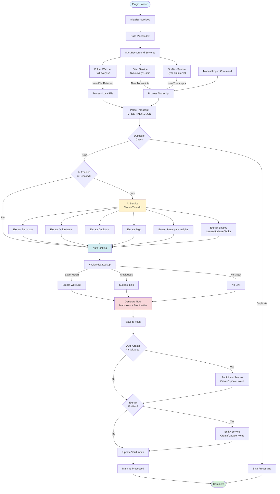
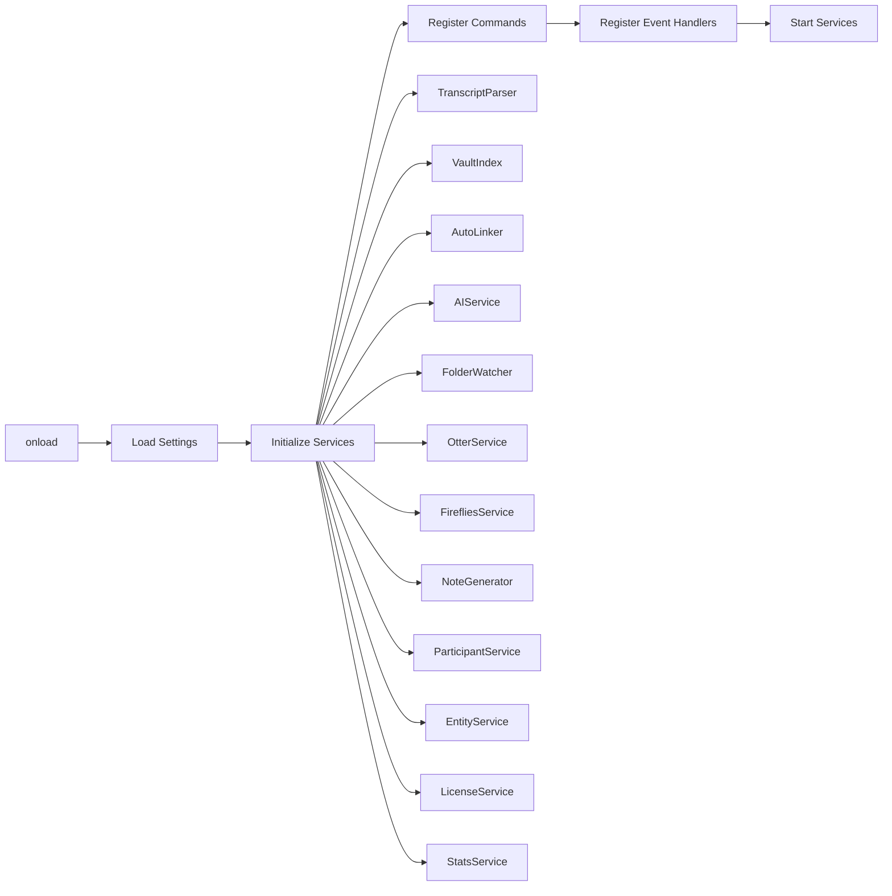
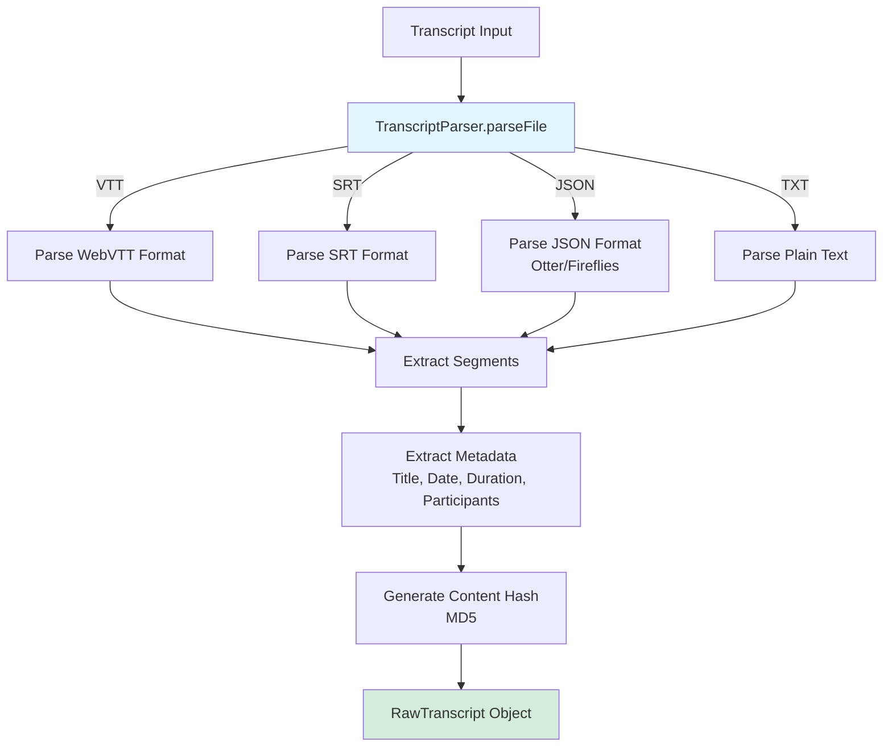
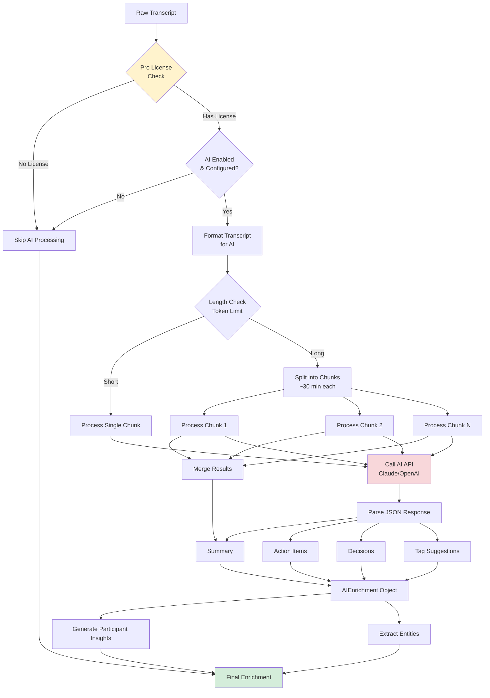
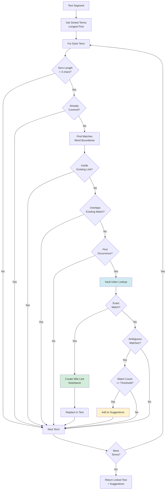
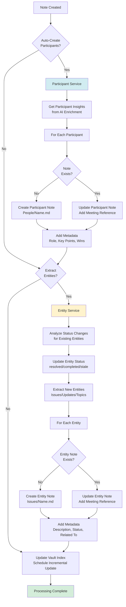
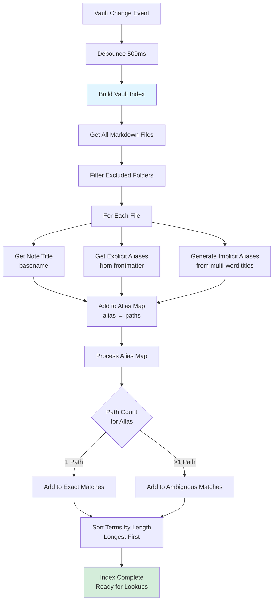
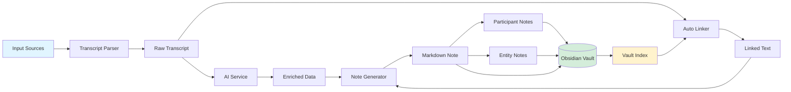
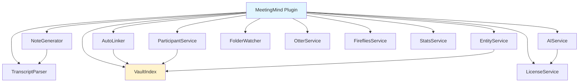

# MeetingMind Engineering Flow Diagram

This document illustrates the engineering flow of how the MeetingMind plugin processes meeting transcripts and creates enriched Obsidian notes.

## High-Level Architecture Flow

## Detailed Component Flow

### 1. Plugin Initialization

### 2. Transcript Processing Pipeline

### 3. AI Enrichment Flow

### 4. Auto-Linking Flow

### 5. Note Generation Flow

```mermaid
flowchart TD
    ProcessedMeeting[ProcessedMeeting Object] --> BuildFrontmatter[Build YAML Frontmatter<br/>Date, Duration, Participants, Tags]
    
    BuildFrontmatter --> BuildSummary{Has<br/>Summary?}
    BuildSummary -->|Yes| SummarySection["Summary Section"]
    BuildSummary -->|No| BuildActions
    
    SummarySection --> BuildActions{Has Action<br/>Items?}
    BuildActions -->|Yes| ActionsSection["Action Items Section<br/>Task with assignee and due date"]
    BuildActions -->|No| BuildDecisions
    
    ActionsSection --> BuildDecisions{Has<br/>Decisions?}
    BuildDecisions -->|Yes| DecisionsSection["Decisions Section<br/>Decision text"]
    BuildDecisions -->|No| BuildTranscript
    
    DecisionsSection --> BuildTranscript["Transcript Section<br/>Collapsible Callout"]
    BuildTranscript --> BuildSuggestions{Has Suggested<br/>Links?}
    
    BuildSuggestions -->|Yes| SuggestionsSection["Suggested Links Section<br/>Manual resolution needed"]
    BuildSuggestions -->|No| Combine[Combine All Sections]
    
    SuggestionsSection --> Combine
    
    Combine --> GenerateFilename["Generate Filename<br/>Template: YYYY-MM-DD Title"]
    GenerateFilename --> CheckCollision{Filename<br/>Collision?}
    
    CheckCollision -->|Yes| ResolveCollision["Append Number<br/>Title with number suffix"]
    CheckCollision -->|No| CreateFile[Create File in Vault]
    
    ResolveCollision --> CreateFile
    CreateFile --> NoteCreated[Note Created]
    
    style BuildFrontmatter fill:#e1f5ff
    style CreateFile fill:#d4edda
```

### 6. Participant & Entity Processing Flow

### 7. Vault Index Maintenance

## Data Flow Summary

## Service Dependencies

## Key Processing Steps

1. **Input Acquisition**: Multiple sources (folder watcher, Otter sync, Fireflies sync, manual import)
2. **Parsing**: Convert various formats (VTT, SRT, TXT, JSON) into standardized `RawTranscript`
3. **Deduplication**: Hash-based duplicate detection to prevent reprocessing
4. **AI Enrichment**: Optional Pro feature for summaries, action items, decisions, tags, insights
5. **Auto-Linking**: Intelligent linking to existing vault notes using vault index
6. **Note Generation**: Create formatted Markdown notes with frontmatter
7. **Entity Processing**: Auto-create/update participant and entity notes
8. **Index Maintenance**: Keep vault index updated for accurate linking

## Error Handling

- All services handle errors gracefully and continue processing
- Failed AI enrichment doesn't block note creation
- Duplicate transcripts are skipped with logging
- Invalid transcripts are logged but don't crash the plugin
- Network errors in sync services use exponential backoff retry

